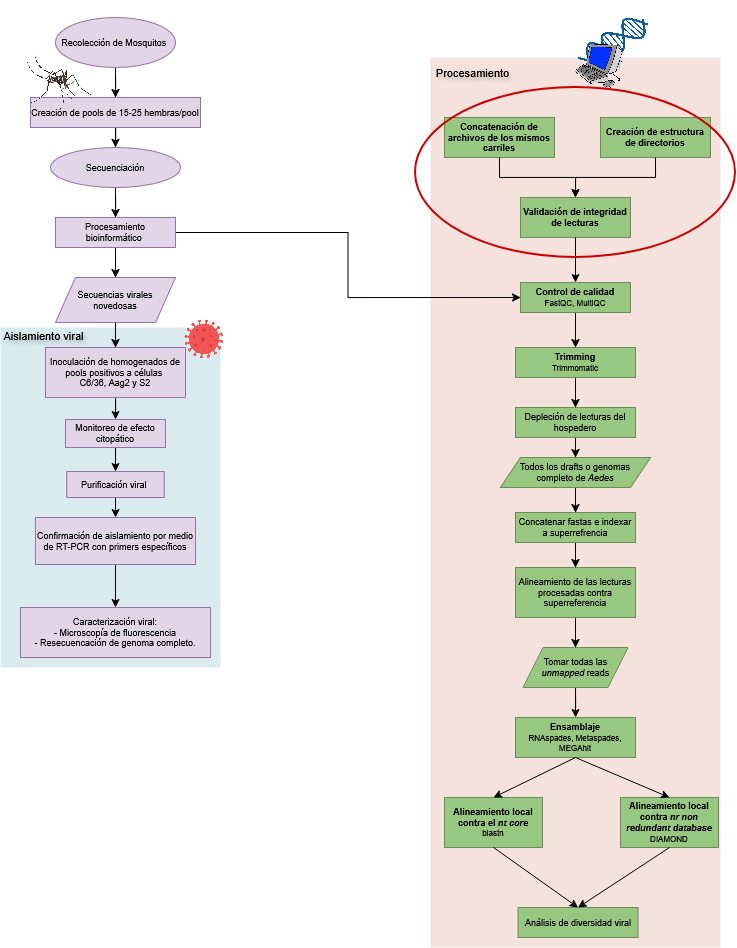

# <u>Validación de archivos FASTQ de secuenciación de transcriptomas de mosquitos de las especies *Aedes serratus* y *Aedes taeniorhynchus* de la península de Yucatán, México.</u>

## Introducción
Las enfermedades infecciosas emergentes son aquéllas, conocidas o no, que tienen el potencial de causar brotes con importante impacto financiero y en salud pública. Pueden ser recién introducidas a una población o pueden haber experimentado un aumento significativo en su incidencia o en su rango geográfico. Estos cambios se relacionan con factores ambientales, como cambios climatológicos o ecológicos, al igual que con procesos evolutivos que le permiten al patógeno infectar nuevos hospederos, lo que implica cambios demográficos y de distribución de la enfermedad.  Los virus, entre estos patógenos, representan un riesgo a la salud debido a la adaptabilidad que poseen a raíz de variaciones genéticas impuestas por sus tiempos generacionales cortos y altas tasas de mutación y evolutivas, particularmente los que poseen un genoma de RNA que son la clase más común de patógenos detrás de enfermedades humanas emergentes al año. 

Cabe aclarar que no todo el viroma de los mosquitos está directamente asociado a enfermedades humanas ya que pueden existir virus que generan infecciones subclínicas (asintomáticos, encubiertos o latentes) y virus comensales. De hecho, la mayoría de los virus de RNA en mosquitos sólo se pueden replicar en el insecto, por lo que se les conoce como virus específicos de insecto (VEI). Consecuentemente, aunque no todos los virus que naturalmente albergan distintas especies de mosquitos son necesariamente patógenos, ocupan un lugar prioritario como objetos de investigación, dado que pueden influir en el mantenimiento de patógenos, modular la transmisión o influir en emergencia viral.

La relación virus-mosquito-hospedero está determinada por factores extrínsecos e intrínsecos. Dichas condiciones interactúan y contribuyen a la capacidad de transmisión al influir sobre la supervivencia, fecundidad y comportamiento alimenticio del vector. Estudios metagenómicos revelan que los viromas presentan: (1) variaciones estacionales marcadas, con mayor diversidad y abundancia viral en meses cálidos, (2) posibles diferencias significativas entre hábitats urbanos y silvestres, asociadas a cambios en la disponibilidad de hospederos y condiciones ecológicas y (3) a variabilidad geográfica se relaciona con el taxón al que pertenece el vector, donde los viromas generalmente son específicos a nivel de género y los que ocupan un rango geográfico mayor suelen albergar viromas más diversos. Tal dinamismo exige enfoques de vigilancia que integren genómica, ecología de patógenos y modelos predictivos con tal de comprender las dinámicas de transmisión entre reservorios animales, vectores y humanos.


## Objetivo
El objetivo de este proyecto es validar la integridad de los archivos FASTQ obtenidos de la secuenciación de transcriptomas de mosquitos de las especies *Ae. serratus* y *Ae. taeniorhynchus* de la península de Yucatán, México. Esta validación es crucial para asegurar la calidad de los datos antes de proceder con análisis posteriores, como el ensamblaje y la anotación de secuencias virales presentes en los mosquitos.

## Descripción general del proyecto
El proyecto se divide en varias etapas. En general, la porción del proyecto que se describe en este documento se enfoca en la etapa de validación de los archivos FASTQ, que es una parte fundamental del flujo de trabajo general para la caracterización de secuencias virales en mosquitos. Sin embargo, dentro del proyecto en general, se cortan las secuencias, se depletan las lecturas del hospedero con mapeo a genomas de referencia de mosquiitos, se hace ensamblaje *de novo* con distintos progrmas y se hace anotación de las secuencias ensambladas con BLAST y DIAMOND.


Este script se enfoca en una etapa no contemplada en un principio durante el planteamiento del flujo de trabajo, sin embargo, importante para asegurar la integridad de los análisis posteriores. La idea en general es establecer un flujo de trabajo para validación de los datos, que incluya la concatenación de archivos de carriles (L001 y L002), la validación de la estructura de los archivos FASTQ, la generación de sumas de verificación MD5 y una prueba de validación de la calidad de las secuencias con FastQC y MultiQC. Como se muestra en el siguiente diagrama de flujo, sólo la parte de validación de los archivos FASTQ son los que resuelve el código que se presenta en este documento:



## Estructura del proyecto
Gran parte de los scripts y análisis dependen de la organización de archivos y directorios como se muestra a continuación. En el caso de que se modifique dicha organización, es importante actualizar los scripts en consideración de cualquier cambio realizado.

```
mosquito_virome_yucatan_LEVE/
│
├── containers/
│
├── data/
│   ├── raw/
│   |   ├── total_RNA/
│   |   │   └── [samples]
│   |   ├── small_RNA/
│   |   │   └── [samples]/
│   |   └── metadata/
│   |       └── [metadata files]
│   ├── references/
|   │   ├── mosquito_genomes/
|   │   │   └── aedes_super_index/
|   │   └── databases/
|   │       ├── BLAST/
|   │       └── DIAMOND/
│
├── results/
│   ├── untrimmed_qc/
│   │   └── fastqc/
│   │   └── multiqc/
│   ├── trimmed/
│   ├── trimmed_qc/
│   │   └── fastqc/
│   │   └── multiqc/
│   ├── aligned/
│   └── assembly/
│       ├── statistics/
│       ├── rnaSPAdes/
│       │   └── [samples]/
│       ├── metaSPAdes/
│       │   └── [samples]/
│       ├── MEGAhit/
│       │   └── [samples]/
│
├── logs/
│   ├── trimming/
│   ├── mapping/
│   ├── assembly/
│   └── blast/
│
├── docs/
│   └── aedes_genomes_specs/
│
└── scripts/
    ├── aedes_reference_genomes/
    ├── databases/
    ├── pipeline_whole/
    └── individual_analyses/
```


## Requisitos de software
- ```FastQC``` v0.11.9
- ```MultiQC``` version 1.34
- ```apptainer``` version 1.4.5
- ```GNU bash```, version 5.2.21(1)-release (x86_64-pc-linux-gnu)
  - case
  - echo
  - find
  - for
  - if
  - elif
  - local
  - source
  - mkdir
  - pwd
  - ls
  - grep
  - cat
  - read
  - rm
  - gzip
  - basename

## Configuración del entorno
El entorno de trabajo se configuró en una computadora de escritorio con Windows 11 Home, utilizando WSL2 para ejecutar un entorno Linux. Se utilizó ```apptainer``` para la gestión de contenedores y en el caso de FastQC y MultiQC, se utilizó un solo contenedor para ambos programas: ```pipeline_calidad.sif```. Se adjunta el script para la generación del contenedor en la carpeta ```containers/``` bajo el nombre ```pipeline_calidad.def```. El contenedor se generó con Ubuntu 22.04 como sistema operativo, con FastQC v0.11.9 y 
MultiQC version 1.34 instalados. 

## Uso del proyecto
El proyecto contempla distintos pasos para validar los archivos. 
1. En primer lugar, se hace una concatenación de los archivos, dado que algunos de los archivos se encuentran separados por carriles (L001 y L002).
2. En segundo lugar se hace una validación de la estructura de los directorios. 
3. En tercer lugar, se hace una validación de la estructura de los archivos FASTQ. Para esto, se espera que se tenga la siguiente estructura por lectura:
   
```
@SEQ_ID
SECUENCIA
+ (SEPARADOR)
CALIDAD
```

4. En cuarto lugar, se hace la validación de la calidad de secuencias con FastQC y MultiQC. Para esto, se escribió un script para la modificación de los nombres de los archivos FASTQ, dado que hay porciones de los nombres poco informativas.

### Ejecución de los scripts
Para la ejecución de los scripts se recomienda tener la misma estrutura de archivos y directorios que se muestra en la sección de Estructura del proyecto. Los pasos que se deben seguir para la ejecución de los scripts son los siguientes: 
1. Clonar el repositorio en la computadora con:
``` git clone remote git@github.com:P-arsimony/tareas_intro_bash_bioinfo.git ```

2. Moverse a la carpeta ```scripts/individual_analyses/``` con:
``` cd tareas_intro_bash_bioinfo/Proyecto_Final/scripts/individual_analyses/ ```

3. Ejecutar el script de creación de directorios en el caso de que no se tengan los directorios creados con:
``` bash crear_directorios.sh ```

4. En el caso de que los archivos de carriles (L001 y L002) estén separados, ejectuar el script de concatenación de archivos con:
``` bash concatenar_archivos.sh ```

5. Ejectutar el script de validación de la estructura de los archivos FASTQ con:
``` bash validar_estructura_fastq.sh ``` proporcionando como argumento el directorio donde se ubican los archivos FASTQ. Por ejemplo:
``` bash validar_estructura_fastq.sh ../../data/raw/total_RNA/ ```

6. Ejecutar el script de validación de calidad de secuencias con MultiQC y FastQC con:
``` bash validar_calidad_secuencias.sh ``` En este caso se puede o no propocionar como argumento el directorio donde se ubican los archivos. Por defecto, el script busca los archivos en: ```/../data/raw/total_RNA/cat_files```


## Entradas y salidas


## Información del sistema
El hardaware en donde se ejecutó el proyecto fue el siguiente:
- **Tipo de equipo**: Computadora de escritorio.
- **Sistema operativo**: Windows 11 Home, versión 10.0.26200, arquitectura x64.
- **CPU**: Ryzen 9 9950X @ 4.30GHz (16 núcleos, 32 hilos). Overclocking hasta 5.70GHz.
- **Memoria RAM**: 64 GB DDR5 6000 MHz. Capacidad máXima soportada por RAM: 128 Gb. 2 de 4 ranuras usadas.
- **Almacenamiento**: SSD NVMe de 2 TB.
- **GPU**: AMD Radeon RX 7700 XT 12 GB GDDR6 (no utilizada en el análisis).
- **Tiempo de ejecución**: Sólo se utilizó una pequeña porción de los .

## Autoría
- **Nombre del autor**: Jorge Alberto Castro Rodríguez
- **Tema de investigación**: Caracterización de Secuencias Virales de Especies de Mosquitos de Importancia Médica
- **Institución**: Instituto de Investigaciones Biomédicas, UNAM