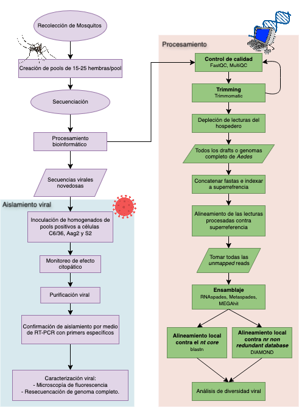

# Caracterización de Secuencias Virales de Especies de Mosquitos de Importancia Médica.

## Introducción.

De todos los arbovirus que causan enfermedades humanas, alrededor del 90% son transmitidas por mosquitos (Öhlund et al., 2019). Sin embargo, la mayoría del repertorio de virus de RNA de mosquitos sólo se pueden replicar en él y no mantienen ciclos virales entre un vector y un animal vertebrado, por lo que se les conoce como virus específicos de insectos (*ISVs*, por sus siglas en inglés). Consecuentemente, aunque no todos los virus que naturalmente albergan distintas especies de mosquitos son necesariamente patógenos y no representan un problema de salud pública per se, pueden influir en el mantenimiento de patógenos, modular la transmisión, la competencia vectorial e influir en la emergencia viral (Lewis et al., 2023; Liu et al., 2023; Olmo et al., 2023).

La idea de un microbioma central (*core microbiome*) se alinea con la identificación de factores comunes compartidos entre microbiomas de varios individuos, lo que implica un amplio rango de características compartidas entre individuos de una población (Neu et al., 2021). Los virus que componen este microbioma tienen un rol comensal, caracterizado por la ausencia de síntomas clínicos en el hospedero (Haynes & Rohwer, 2010). Así, el término *core virome* se acuñó específicamente para describir un conjunto de virus que se comparte entre la mayoría de los individuos en una población de mosquitos (Shi et al., 2019). Asimismo, la relación virus-mosquito está determinada por factores extrínsecos e intrínsecos; dichas condiciones interactúan y contribuyen al dinamismo de los viromas. Por ejemplo, estudios metagenómicos revelan que presentan: (1) variaciones estacionales con mayor diversidad y abundancia viral en meses cálidos (Liu et al., 2023), (2) diferencias entre hábitats urbanos y silvestres, asociadas a cambios en la disponibilidad de hospederos y condiciones ecológicas (Wang et al., 2024), (3) abundancia y composición a nivel de familia viral diferente en función de las distribuciones de los vectores (Pettersson et al., 2019) y (4) variabilidad geográfica que se relaciona con el taxón al que pertenece el vector, donde los viromas generalmente son específicos a nivel de género y los que ocupan un rango geográfico mayor suelen albergar viromas más diversos (Shi et al., 2017). 

En años recientes, el desarrollo de técnicas experimentales y el cambio de aproximaciones metodológicas, como la popularización de estudios metagenómicos para analizar mosquitos, ha dado lugar a un aumento en el descubrimiento de especies virales (Rosenberg et al., 2013). Por ejemplo, estudios de metatranscriptómica han identificado más de 40 nuevos virus en mosquitos silvestres de los géneros Aedes, Culex y Culiseta (Batson et al., 2021). Sin embargo, la mera detección de secuencias virales a nivel de RNA total no permite discriminar entre infecciones activas, material viral residual o Elementos Virales Endógenos (EVEs). En mosquitos, tanto las infecciones por ISVs como por arbovirus activan la vía de los RNAs de interferencia (RNAi) que se clasifican según su tamaño, biogénesis y proteínas asociadas en: microRNAs (~20-22 nt), pequeños RNAs de interferencia (siRNAs, ~20-22 nt) y RNAs que interaccionan con PIWI (piRNAs, ~25-30 nt) (Tikhe & Dimopoulos, 2021; Trammell & Goodman, 2021). En este contexto, los EVEs no retrovirales adquieren una relevancia particular, ya que en mosquitos del género *Aedes*, se encuentran enriquecidos en clusters de piRNAs y se transcriben generando piRNAs antisentido contra virus cognados. En el caso de siRNAs, éstos se encuentran de manera consistente cubriendo el genomas virales, lo que permite la reconstrucción de secuencias virales que infectan mosquitos (Palatini et al., 2022).

En conjunto, este proyecto busca caracterizar los viromas con base en datos de RNA total y RNAs pequeños en mosquitos pertenecientes a las especies *Ae. serratus* y *Ae. taeniorhynchus* con tal de identificar posibles patrones y factores biogeográficos, ecológicos y/o taxonómicos que moldeen la composición y su dinámica.

## Objetivos.
Caracterizar la diversidad viral en los mosquitos *Ae. serratus* y *Ae. taeniorhynchus* de la República Mexicana colectados en la península de Yucatán y de ambientes contrastantes (regiones conservadas, diversificadas y urbanas) a partir de RNA total y RNAs pequeños.

### Objetivos específicos

- Caracterizar el viroma de especies de mosquitos colectadas en la península de Yucatán, de 4 tipos de hábitats y realizar la caracterización genética y virológica de los virus detectados.
- Identificar y analizar posibles secuencias virales novedosas.
- Determinar si existen posibles patrones y factores biogeográficos, ecológicos y/o taxonómicos asociados a la composición de sus viromas.

## Flujo de Trabajo

Las muestras de mosquitos se hicieron entre 2021-22. A partir de ellas, se realizaron pools de 15-25 especímenes. Para la carcaterización de viromas se secuenciaron los homegenados para obtener RNA total y RNAs pequeños. El flujo de trabajo propuesto para este proyecto consiste en varias etapas: limpieza de las secuencias para que tengan una calidad adecuada, corte de secuencias para eliminar adaptadores y bases de baja calidad, eliminación de lecturas del hospedero, ensamblaje completo del genoma de *Aedes*, concatenación de contigs y alineamiento de superscaffold, alineamiento local contra nucleótidos y aminoácidos y análisis de diversidad viral.

El esquema general de análisis se muestra a continuación:



## Estructura de carpetas.
La estructura de carpetas propuesta para organizar los archivos y resultados del proyecto es la siguiente:

```
project_root/
├── data/
│   ├── results/
│       ├── tables/                    # Tabular results
│       ├── figures/                   # Generated figures
│       ├── reports/                   # HTML/MultiQC reports
│       └── viral_sequences/           # Viral identified sequences
├── scr/ # Scripts for data processing, analysis, and pipeline execution
│   ├── scripts/
│   │   ├── pipeline/               
│   │   │   ├── quality_control.sh
│   │   │   ├── trimming.sh
│   │   │   ├── host_sequence_removal.sh
│   │   │   ├── assembly.sh
│   │   │   ├── viral_identification.sh
│   │   │   ├── complete_pipeline.sh
├── metadata/ # Metadata files for samples, including collection details, sequencing information, etc.
├── docs/ # Documentation, including methods, protocols, and any relevant literature reviews
│   ├── methods.md
│   ├── protocols/
├── analyses/ # Specific analyses such as diversity analysis, phylogenetics, etc.
├── images/ # For storing any images used in documentation or reports
├── README.md
```

## Programas a utilizar.

1. Control de calidad: **FastQC** (Andrews, 2010) y **MultiQC** (Ewels et al., 2016).
2. Corte de secuencias: **Trimmomatic** (Bolger et al., 2014).
3. Generación de superreferencia de diferentes genomas de mosquitos y alineamiento para depletar lecturas del hospedero: **STAR** (Dobin et al., 2013).
4. Ensamblaje de lecturas que no se alinearon al hospedero: **MEGAHIT** (Li et al., 2015) y **SPAdes** (Prijbelski et al., 2020).
5. Anotación de secuencias y proteínas virales: **BLAST** (Altschul et al., 1990) y **Diamond** (Buchfink et al., 2015).

## Referencias
1. Andrews, S. (2010). FastQC: A Quality Control Tool for High Throughput Sequence Data. Retrieved from http://www.bioinformatics.babraham.ac.uk/projects/fastqc/
2. Batson, J., Dudas, G., Haas-Stapleton, E., Kistler, A. L., Li, L. M., Logan, P., Ratnasiri, K., & Retallack, H. (2021). Single mosquito metatranscriptomics identifies vectors, emerging pathogens and reservoirs in one assay. ELife, 10, e68353. https://doi.org/10.7554/eLife.68353
3. Bolger, A. M., Lohse, M., & Usadel, B. (2014). Trimmomatic: a flexible trimmer for Illumina sequence data. Bioinformatics, 30(15), 2114–2120. https://doi.org/10.1093/bioinformatics/btu170
4. Dobin, A., Davis, C. A., Schlesinger, F., Drenkow, J., Zaleski, C., Jha, S., Batut, P., Chaisson, M., & Gingeras, T. R. (2013). STAR: ultrafast universal RNA-seq aligner. Bioinformatics, 29(1), 15–21. https://doi.org/10.1093/bioinformatics/bts635
5. Ewels, P., Magnusson, M., Lundin, S., & Käller, M. (2016). MultiQC: summarize analysis results for multiple tools and samples in a single report. Bioinformatics, 32(19), 3047–3048. https://doi.org/10.1093/bioinformatics/btw354
6. Genome [Internet]. Bethesda (MD): National Library of Medicine (US), National Center for Biotechnology Information; 2004 – [cited 2025/08/25]. Available from: https://www.ncbi.nlm.nih.gov/datasets/genome/
7. Haynes, M., & Rohwer, F. (2010). The Human Virome. In Metagenomics of the Human Body (pp. 63–77). Springer. https://doi.org/10.1007/978-1-4419-7089-3_4
8. Lewis, J., Gallichotte, E. N., Randall, J., Glass, A., Foy, B. D., Ebel, G. D., & Kading, R. C. (2023). Intrinsic factors driving mosquito vector competence and viral evolution: a review. Frontiers in Cellular and Infection Microbiology, 13. https://doi.org/10.3389/fcimb.2023.1330600
9.  Li, D., Liu, C.-M., Luo, R., Sadakane, K., & Lam, T.-W. (2015). MEGAHIT: an ultra-fast single-node solution for large and complex metagenomics assembly via succinct de Bruijn graph. Bioinformatics, 31(10), 1674–1676. https://doi.org/10.1093/bioinformatics/btv033
10. Liu, Q., Cui, F., Liu, X., Fu, Y., Fang, W., Kang, X., Lu, H., Li, S., Liu, B., Guo, W., Xia, Q., Kang, L., & Jiang, F. (2023). Association of virome dynamics with mosquito species and environmental factors. Microbiome, 11(1). https://doi.org/10.1186/s40168-023-01556-4
11. Neu, A. T., Allen, E. E., & Roy, K. (2021). Defining and quantifying the core microbiome: Challenges and prospects. Proceedings of the National Academy of Sciences, 118(51). https://doi.org/10.1073/pnas.2104429118
12. Öhlund, P., Lundén, H., & Blomström, A.-L. (2019). Insect-specific virus evolution and potential effects on vector competence. Virus Genes, 55(2), 127–137. https://doi.org/10.1007/s11262-018-01629-9
13. Olmo, R. P., Todjro, Y. M. H., Aguiar, E. R. G. R., de Almeida, J. P. P., Ferreira, F. V., Armache, J. N., de Faria, I. J. S., Ferreira, A. G. A., Amadou, S. C. G., Silva, A. T. S., de Souza, K. P. R., Vilela, A. P. P., Babarit, A., Tan, C. H., Diallo, M., Gaye, A., Paupy, C., Obame-Nkoghe, J., Visser, T. M., & Koenraadt, C. J. M. (2023). Mosquito vector competence for dengue is modulated by insect-specific viruses. Nature Microbiology, 8(1), 135–149. https://doi.org/10.1038/s41564-022-01289-4
14. Palatini, U., Alfano, N., Carballar-Lejarazu, R., Chen, X.-G., Delatte, H., & Bonizzoni, M. (2022). Virome and nrEVEome diversity of Aedes albopictus mosquitoes from La Reunion Island and China. Virology Journal, 19(1). https://doi.org/10.1186/s12985-022-01918-8
15. Pettersson, J. H.-O. ., Shi, M., Eden, J.-S., Holmes, E. C., & Hesson, J. C. (2019). Meta-Transcriptomic Comparison of the RNA Viromes of the Mosquito Vectors Culex pipiens and Culex torrentium in Northern Europe. Viruses, 11(11), 1033. https://doi.org/10.3390/v11111033
16. Prijbelski, A., Antipov, D., Meleshko, D., Lapidus, A., & Korobeynikov, A. (2020). Using SPAdes de novo assembler. Current Protocols in Bioinformatics, 70(1), e102. https://doi.org/10.1002/cpbi.102
17. Shi, C., Beller, L., Deboutte, W., Yinda, K. C., Delang, L., Vega-Rúa, A., Failloux, A.-B., & Matthijnssens, J. (2019). Stable distinct core eukaryotic viromes in different mosquito species from Guadeloupe, using single mosquito viral metagenomics. Microbiome, 7(1). https://doi.org/10.1186/s40168-019-0734-2
18. Shi, M., Neville, P., Nicholson, J., Eden, J.-S., Imrie, A., & Holmes, E. C. (2017). High-Resolution Metatranscriptomics Reveals the Ecological Dynamics of Mosquito-Associated RNA Viruses in Western Australia. Journal of Virology, 91(17). https://doi.org/10.1128/jvi.00680-17
19. Tikhe, C. V., & Dimopoulos, G. (2021). Mosquito antiviral immune pathways. Developmental & Comparative Immunology, 116, 103964. https://doi.org/10.1016/j.dci.2020.103964
20. Trammell, C. E., & Goodman, A. G. (2021). Host Factors That Control Mosquito-Borne Viral Infections in Humans and Their Vector. Viruses, 13(5), 748. https://doi.org/10.3390/v13050748
21. World Health Organization. (2017). Global vector control response 2017–2030. https://www.who.int/publications/i/item/9789241512978